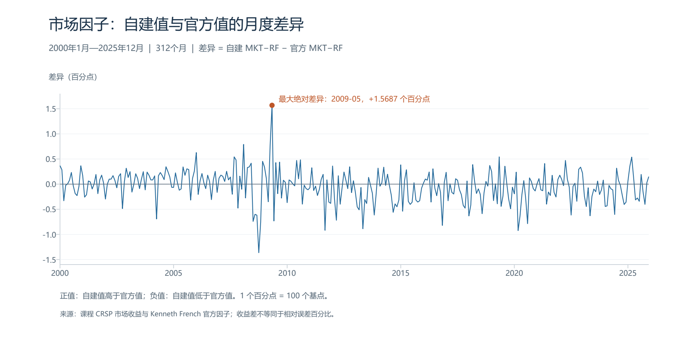

# 市场因子阶段性检查

样本为 2000 年 1 月至 2025 年 12 月，共 312 个月。本检查只针对 MKT−RF；SMB、HML 尚未自行构造。

## 检查结果

月份连续且唯一，所用收益无缺失。逐月复核了市场收益、RF、官方市场因子的来源对齐，以及两项减法，全部通过。

| 指标 | 数值 | 单位 |
|---|---:|---|
| 有效月份数 | 312.000000 | 月 |
| 皮尔逊相关系数 | 0.997462 | 无单位 |
| 平均误差（自建减官方） | -0.045509 | 百分点 |
| 平均绝对误差 | 0.245770 | 百分点 |
| 均方根误差 | 0.325614 | 百分点 |
| 最大绝对误差 | 1.568700 | 百分点 |

两条序列的共同波动很接近，但水平存在差异。平均误差为 -0.0455 个百分点；平均绝对误差为 0.2458 个百分点（24.58 个基点）。不能仅凭高相关系数判断已精确复现官方市场因子。

## 偏差最大的月份

下表列出绝对差异最大的三个月，前十个月另见表格文件。

| 月份 | 自建 MKT−RF | 官方 MKT−RF | 差异（百分点） |
|---|---:|---:|---:|
| 2009-05 | 6.7787% | 5.2100% | +1.5687 |
| 2008-10 | -18.5633% | -17.2000% | -1.3633 |
| 2020-03 | -14.2933% | -13.3700% | -0.9233 |

## 已确认的事实与待核实的原因

- 自建值等于 `vwretd − RF`，差异等于自建值减官方值，逐月十进制精确运算均正确；输入已是小数，没有重复除以 100。
- 两条因子使用同一官方 RF，因此差异也等于 `vwretd − (官方 Mkt-RF + RF)`。减去 RF 这一步不是当前偏差的来源，差异存在于 CRSP 市场收益与官方因子隐含的市场收益之间。
- 官方因子来自课程文件标注的 202607 CRSP 数据库版本。当前尚未确认课程股票文件的提取版本与其完全一致。
- 市场股票覆盖范围、历史数据修订及收益构造口径是需要核实的候选原因，目前不能断言某一项就是原因。官方因子原始数值的显示精度也可能造成很小的舍入差异，不能解释百分点级的大偏差。
- 这份结果确认了当前数据下的日期对齐和运算正确，并不等于已经完成严格同口径的市场组合重建。

## 下一步

保留现有市场因子结果，在报告中说明其使用 CRSP 现成市场指数的口径。继续准备 SMB、HML，随后统一制作三个因子的正式描述性统计与累计收益图。如要求更严格贴合官方市场因子，应核实数据版本和市场股票筛选范围，再决定是否从个股重新构造市场组合。

官方口径参考：[三因子定义](https://mba.tuck.dartmouth.edu/pages/faculty/ken.french/Data_Library/f-f_factors.html)、[数据版本与 CIZ 说明](https://mba.tuck.dartmouth.edu/pages/faculty/ken.french/data_library.html)。

运行脚本：`python code/Others/check_market_factor.py`。Python 绘图依赖为 `reportlab`、`pypdfium2`；中文字体使用 Windows 微软雅黑。

市场因子与官方序列高度相关，但存在尚未解释的偏差。目前已确认日期匹配、单位转换和减法正确，市场覆盖口径与数据版本仍待核实。
